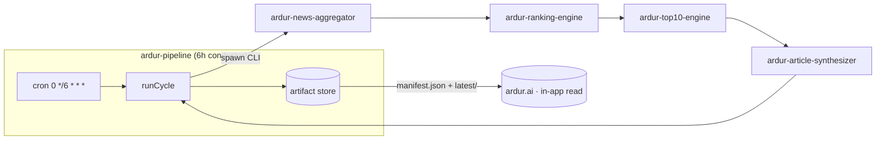

# ardur-pipeline

**The end-to-end orchestrator for the Ardur AI content pipeline.** Every 6 hours it
runs the four engines in order — **aggregate → rank → top-10 → synthesize** — and
publishes the artifacts [`ardur.ai`](https://github.com/ArdurAI/ardur.ai) consumes.

> Schema: **`ardur-content-pipeline/v1`** · Node ≥ 22 · TypeScript · MIT
>
> This repo is the **conductor and runtime host**. The actual content logic lives in
> the four engine repos; this repo spawns their CLIs, threads one cycle through them,
> and owns scheduling, idempotency, last-good-wins, observability, and the site handoff.
> It references the engines' canonical [`contracts.ts`](./src/contracts.ts) (vendored
> byte-identical) and never forks engine logic.

## What it does



- **6-hour cycle**, UTC-aligned (`floor(now, 6h)` → 00:00 / 06:00 / 12:00 / 18:00).
- **Idempotent** per cycle id — a delayed, retried, or backfilled trigger is the same cycle.
- **Last-good-wins** — a failed cycle publishes nothing; the previous cycle keeps serving.
- **Deterministic / budget=0 by default** — the whole chain runs with no API key and no
  network model call, and still produces a complete, publishable cycle.
- **Observable** — structured per-stage logs, a `RunResult` summary, artifact upload, and
  a webhook alert on `failed` / `degraded`.

## Quickstart

```bash
# 1. clone the orchestrator
git clone https://github.com/ArdurAI/ardur-pipeline.git
cd ardur-pipeline

# 2. bootstrap — clone/pull + install all four engine repos as siblings
./scripts/bootstrap.sh              # safe to re-run; respects .env overrides
cp .env.example .env                # defaults are safe: deterministic, budget=0

# 3. run the current cycle (logs -> stderr, RunResult JSON -> stdout)
npm run cycle

# backfill a specific window
node --experimental-strip-types src/cli.ts --at 2026-06-11T06:00:00Z

# dry-run: all four stages run, archive written, latest/ + manifest.json unchanged
node --experimental-strip-types src/cli.ts --dry-run

# the published store lands in ./.artifacts (manifest.json + latest/ + cycles/)
```

Exit code: `0` for `published | degraded | skipped`, `1` for `failed`.

## Running individual stages

The pipeline has a hard AI boundary: **the LLM is called only during `synthesize`**. Every
other stage is a deterministic script with zero tokens.

```
[DETERMINISTIC — 0 tokens]           [AI — tokens here only]
aggregate → rank → top10   ────────►   synthesize
     └──── prepare ──┘
```

Each stage is a standalone npm script:

| Command | What runs | Tokens |
|---------|-----------|--------|
| `npm run aggregate` | aggregator engine only | 0 |
| `npm run rank` | ranking engine (reads `aggregation.json`) | 0 |
| `npm run top10` | top-10 engine (reads `ranking.json` + `aggregation.json`) | 0 |
| `npm run stage:prepare` | aggregate → rank → top10 in one shot | **0** |
| `npm run synthesize` | article synthesizer (reads `top10.json` + `aggregation.json`) | **AI** |
| `npm run cycle` | stage:prepare + synthesize + publish (full scheduled cycle) | AI |
| `npm run cycle:no-ai` | full cycle, `ARDUR_AI_MAX_GENERATIONS=0` — all articles HELD | **0** |
| `npm run hermes` | Hermes entry point: stage:prepare + synthesize → handoff JSON | AI |
| `npm run hermes -- --prepare-only` | stage:prepare only → handoff with top-10, no articles | **0** |

Stage commands read/write artifacts from `.artifacts/prepared/` by default.
Override with `-- --work-dir <path>`.

```bash
# Run just the deterministic half — verify pipeline health, inspect clusters, no tokens:
npm run stage:prepare                  # → .artifacts/prepared/{aggregation,ranking,top10}.json

# Then run AI synthesis separately (only this step costs tokens):
npm run synthesize                     # → .artifacts/prepared/articles.json

# Or chain them explicitly:
npm run stage:prepare && npm run synthesize

# Verify the full pipeline without spending any tokens:
npm run cycle:no-ai                    # full cycle, all articles HELD, no AI calls
```

## AI boundary and per-article token budget

**The LLM sees only distilled `ExtractedFact[]` and minimal source metadata — not raw article bodies.**

For each top-10 entry the synthesizer sends:

| Input component | Approx. tokens |
|-----------------|----------------|
| System directive + voice directive | ~80 |
| Headline hint + topic label | ~30 |
| `ExtractedFact[]` (up to 20; typical 4–8) | ~150–800 |
| Attribution source refs (title, source, date, URL) | ~150–400 |
| Output format rules | ~200 |
| **Total input per article** | **~610–1,510** |
| Output (synthesized article JSON) | ~500–700 |

**Per full cycle (10 articles):**
- ~10,000 input + ~6,000 output = **~16,000 tokens total**
- At a frontier model tier (~$5–15/M input): **< $0.25 per cycle**, < $1/day at 4 cycles/day

Because the input budget is small, quality scales with model tier rather than prompt
size — use a larger/smarter model to get richer articles, not a bigger prompt.

> **Prompt trim opportunity:** `ardur-article-synthesizer` currently appends a full
> `context draft` JSON (~600 tokens) to the Ollama prompt as a structural hint.
> Removing it would cut per-article input by ~40% with no quality loss.
> See [ardur-article-synthesizer#24](https://github.com/ArdurAI/ardur-article-synthesizer/issues/24).

## How Hermes drives the engines

`scripts/hermes-run.ts` is the single entry point a hermes-agent uses to drive the
pipeline and produce a `news-engine-handoff/v1` artifact ready for `ardur.ai`.

```
hermes-agent
    │
    ├── npm run hermes -- --prepare-only   → .artifacts/hermes-handoff.json (top-10 only, 0 tokens)
    │       │
    │       └── agent reads top-10, runs coverage gates, decides what to synthesize
    │
    └── npm run hermes                     → .artifacts/hermes-handoff.json (top-10 + articles)
            │
            └── ardur.ai reads via ARDUR_NEWS_ENGINE_ARTIFACT=<path>
```

**Handoff format** (`ardur-news-handoff/v1`, consumed by `src/lib/newsEngineSource.ts`):

```json
{
  "schemaVersion": "ardur-news-handoff/v1",
  "generatedAt": "2026-06-11T18:00:00.000Z",
  "top10": { /* Top10Artifact */ },
  "articles": { /* ArticleArtifact — published only, held articles stripped */ }
}
```

**Typical hermes-agent workflow (stub → full):**

1. Agent calls `npm run hermes -- --prepare-only`; receives path to handoff on stdout.
2. Reads `handoff.top10.data.global` to evaluate coverage (has this topic been recently covered?).
3. Checks `CoverageStore` gates (dark-launch curation + exhaustion gates in `orchestrate.ts`).
4. If synthesis is warranted, calls `npm run hermes`; emits the full handoff.
5. Caller sets `ARDUR_NEWS_ENGINE_ARTIFACT=<path>` and triggers an `ardur.ai` build.

The `--prepare-only` split lets the agent inspect the top-10 before spending any tokens,
and gives it a veto point between the deterministic and AI segments.

> **Status:** `scripts/hermes-run.ts` is a working stub — it runs the full pipeline but
> does not yet implement autonomous gate logic. Gate observation is already wired in
> `orchestrate.ts` (dark-launch mode). See [PR#17](https://github.com/ArdurAI/ardur-pipeline/pull/17)
> for the Hermes feasibility study.

## Deploy

**GitHub Actions scheduled workflow** is the recommended runtime
([`.github/workflows/cycle.yml`](./.github/workflows/cycle.yml)): free, native artifacts,
secrets, `workflow_dispatch` backfill, and one place for everything. The job checks out
the four engines as siblings, runs one cycle, and on success pushes the artifact store to
a dedicated **`published`** branch the site reads. Self-hosted cron and serverless are
documented alternatives. See [`docs/spec.md` §3](./docs/spec.md#3-runtime--deploy).

## Data handoff to ardur.ai

The site reads **`manifest.json`** (the last-good pointer) then **`latest/articles.json`**:

```
<store>/manifest.json          # cycle id, status, runIds, nextRefreshAt, top-10 summary
<store>/latest/                # aggregation|ranking|top10|articles .json (atomic set)
<store>/cycles/<cycleId>/      # immutable archive (audit + rollback)
```

`latest/` is swapped atomically (temp + rename) so a reader never sees a half-written set.
Full contract + schema: [`docs/spec.md` §4](./docs/spec.md#4-data-handoff-contract-to-ardurai).

## The four engines

| # | Repo | Produces |
|---|------|----------|
| 1 | [`ardur-news-aggregator`](https://github.com/ArdurAI/ardur-news-aggregator) | `AggregationArtifact` |
| 2 | [`ardur-ranking-engine`](https://github.com/ArdurAI/ardur-ranking-engine) | `RankingArtifact` |
| 3 | [`ardur-top10-engine`](https://github.com/ArdurAI/ardur-top10-engine) | `Top10Artifact` |
| 4 | [`ardur-article-synthesizer`](https://github.com/ArdurAI/ardur-article-synthesizer) | `ArticleArtifact` |

`ardur-top10-engine` also ships an in-process `runCycle` for library embedding; this repo
is the out-of-process conductor that spawns all four CLIs and owns the deploy + handoff.

## Layout

```
src/
  cli.ts          entrypoint — run one full cycle (--at backfill, --dry-run)
  stage-cli.ts    stage-by-stage entrypoint (aggregate|rank|top10|prepare|synthesize)
  orchestrate.ts  the conductor: idempotency, retries, last-good-wins, alerting
  runners.ts      CLI-backed StageRunners — the only place that spawns engines
  store.ts        artifact store + manifest handoff (warning categorization, health)
  cycle.ts        6-hour UTC cycle math
  config.ts       env -> typed config (safe defaults; budget=0)
  retry.ts        bounded retry + backoff
  log.ts          structured logging
  alert.ts        webhook alerting
  metrics.ts      per-cycle metrics (metrics.json + metrics.ndjson + webhook)
  contracts.ts    VENDORED shared wire contract (do not edit here)
  smoke.test.ts   orchestrator glue tests (idempotency, dry-run, metrics, ...)
  golden.test.ts  full end-to-end tests over golden fixtures
scripts/
  bootstrap.sh    one-command local setup (clone/pull + install all engines)
  hermes-run.ts   Hermes entry point — prepare (+ optionally synthesize) → handoff JSON
docs/spec.md      full design spec with diagrams
.github/workflows/cycle.yml   the 6-hour scheduled cycle (engine ref pinning)
```

## Scope boundary

- **In:** scheduling, orchestration, idempotency, retries, observability, the artifact
  store, and the handoff to the site.
- **Out:** engine logic (lives in the engine repos) and cross-engine end-to-end tests
  (owned by `ardur-engine-e2e`).

## License

[MIT](./LICENSE) © ArdurAI

## Hermes provider env (safe allowlist)

When `ARDUR_AI_PROVIDER=hermes`, the pipeline forwards only:

- `GATEWAY_PROXY_URL` / `GATEWAY_PROXY_KEY`
- `HERMES_PROXY_URL` / `HERMES_PROXY_KEY`
- `HERMES_MODEL` / `HERMES_TIMEOUT_MS` / `HERMES_AVAILABLE`

Arbitrary process env is never forwarded to child engines. Mixed-cycle artifacts hard-fail before last-good publication.

