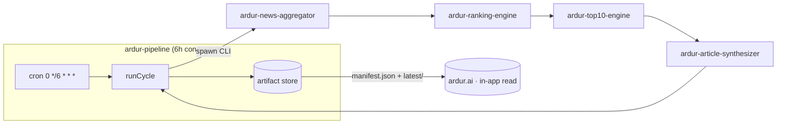

# ardur-pipeline

**The end-to-end orchestrator for the Ardur AI content pipeline.** Every 6 hours it
runs the four engines in order — **aggregate → rank → top-10 → synthesize** — and
publishes the artifacts [`ardur.ai`](https://github.com/ArdurAI/ardur.ai) consumes.

> Schema: **`ardur-content-pipeline/v1`** · Node ≥ 22 · TypeScript · MIT
>
> This repo is the **conductor and runtime host**. The actual content logic lives in
> the four engine repos; this repo spawns their CLIs, threads one cycle through them,
> and owns scheduling, idempotency, last-good-wins, observability, and the site handoff.
> It references the engines' canonical [`contracts.ts`](./src/contracts.ts) (vendored
> byte-identical) and never forks engine logic.

## What it does



- **6-hour cycle**, UTC-aligned (`floor(now, 6h)` → 00:00 / 06:00 / 12:00 / 18:00).
- **Idempotent** per cycle id — a delayed, retried, or backfilled trigger is the same cycle.
- **Last-good-wins** — a failed cycle publishes nothing; the previous cycle keeps serving.
- **Deterministic / budget=0 by default** — the whole chain runs with no API key and no
  network model call, and still produces a complete, publishable cycle.
- **Observable** — structured per-stage logs, a `RunResult` summary, artifact upload, and
  a webhook alert on `failed` / `degraded`.

## Quickstart

```bash
# 1. clone the orchestrator
git clone https://github.com/ArdurAI/ardur-pipeline.git
cd ardur-pipeline

# 2. bootstrap — clone/pull + install all four engine repos as siblings
./scripts/bootstrap.sh              # safe to re-run; respects .env overrides
cp .env.example .env                # defaults are safe: deterministic, budget=0

# 3. run the current cycle (logs -> stderr, RunResult JSON -> stdout)
npm run cycle

# backfill a specific window
node --experimental-strip-types src/cli.ts --at 2026-06-11T06:00:00Z

# dry-run: all four stages run, archive written, latest/ + manifest.json unchanged
node --experimental-strip-types src/cli.ts --dry-run

# the published store lands in ./.artifacts (manifest.json + latest/ + cycles/)
```

Exit code: `0` for `published | degraded | skipped`, `1` for `failed`.

## Deploy

**GitHub Actions scheduled workflow** is the recommended runtime
([`.github/workflows/cycle.yml`](./.github/workflows/cycle.yml)): free, native artifacts,
secrets, `workflow_dispatch` backfill, and one place for everything. The job checks out
the four engines as siblings, runs one cycle, and on success pushes the artifact store to
a dedicated **`published`** branch the site reads, then POSTs the Cloudflare Pages Deploy
Hook so `ardur.ai` rebuilds from the fresh artifacts. Self-hosted cron and serverless are
documented alternatives. See [`docs/spec.md` §3](./docs/spec.md#3-runtime--deploy).

Production repo variables:

- `ARDUR_AI_PROVIDER=deterministic`
- `ARDUR_AI_MAX_GENERATIONS=0`
- `ENGINE_AGGREGATOR_REF`, `ENGINE_RANKING_REF`, `ENGINE_TOP10_REF`, `ENGINE_SYNTHESIZER_REF`
  pinned to known-good engine refs
- `PUBLISHED_CYCLES_TO_KEEP=40` by default; raise/lower this to tune `published` branch
  archive retention

Production repo secrets:

- `CF_PAGES_DEPLOY_HOOK` — required for the Cloudflare Pages rebuild handoff
- `ALERT_WEBHOOK_URL` — recommended for failed/degraded cycle alerts
- `OLLAMA_API_KEY` — optional only for explicitly opted-in Ollama enrichment

`OPENAI_API_KEY` and `PIPELINE_DISPATCH_TOKEN` are not part of the production core path.
Failed cycles publish nothing and do not fire the Deploy Hook; skipped/idempotent cycles
also skip the publish and hook steps.

## Data handoff to ardur.ai

The site reads **`manifest.json`** (the last-good pointer) then **`latest/articles.json`**:

```
<store>/manifest.json          # cycle id, status, runIds, nextRefreshAt, top-10 summary
<store>/latest/                # aggregation|ranking|top10|articles .json (atomic set)
<store>/cycles/<cycleId>/      # immutable archive (audit + rollback)
```

`latest/` is swapped atomically (temp + rename) so a reader never sees a half-written set.
Full contract + schema: [`docs/spec.md` §4](./docs/spec.md#4-data-handoff-contract-to-ardurai).

## The four engines

| #   | Repo                                                                                | Produces              |
| --- | ----------------------------------------------------------------------------------- | --------------------- |
| 1   | [`ardur-news-aggregator`](https://github.com/ArdurAI/ardur-news-aggregator)         | `AggregationArtifact` |
| 2   | [`ardur-ranking-engine`](https://github.com/ArdurAI/ardur-ranking-engine)           | `RankingArtifact`     |
| 3   | [`ardur-top10-engine`](https://github.com/ArdurAI/ardur-top10-engine)               | `Top10Artifact`       |
| 4   | [`ardur-article-synthesizer`](https://github.com/ArdurAI/ardur-article-synthesizer) | `ArticleArtifact`     |

`ardur-top10-engine` also ships an in-process `runCycle` for library embedding; this repo
is the out-of-process conductor that spawns all four CLIs and owns the deploy + handoff.

## Layout

```
src/
  cli.ts          entrypoint — run one cycle (--at backfill, --dry-run)
  orchestrate.ts  the conductor: idempotency, retries, last-good-wins, alerting
  runners.ts      CLI-backed StageRunners — the only place that spawns engines
  store.ts        artifact store + manifest handoff (warning categorization, health)
  cycle.ts        6-hour UTC cycle math
  config.ts       env -> typed config (safe defaults; budget=0)
  retry.ts        bounded retry + backoff
  log.ts          structured logging
  alert.ts        webhook alerting
  metrics.ts      per-cycle metrics (metrics.json + metrics.ndjson + webhook)
  contracts.ts    VENDORED shared wire contract (do not edit here)
  smoke.test.ts   orchestrator glue tests (idempotency, dry-run, metrics, ...)
  golden.test.ts  full end-to-end tests over golden fixtures
scripts/
  bootstrap.sh    one-command local setup (clone/pull + install all engines)
docs/spec.md      full design spec with diagrams
.github/workflows/cycle.yml   the 6-hour scheduled cycle (engine ref pinning)
```

## Scope boundary

- **In:** scheduling, orchestration, idempotency, retries, observability, the artifact
  store, and the handoff to the site.
- **Out:** engine logic (lives in the engine repos) and cross-engine end-to-end tests
  (owned by `ardur-engine-e2e`).

## License

[MIT](./LICENSE) © ArdurAI
