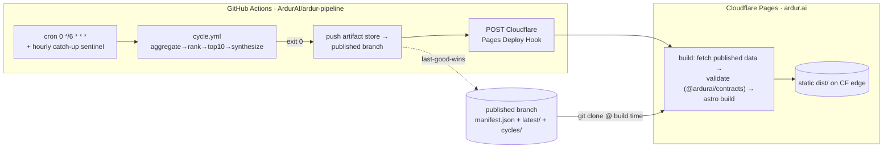

# ardur-pipeline — production deploy plan

> How the 6-hour content cycle runs in **production** and hands its output to
> **ardur.ai** (Cloudflare Pages), with **no paid-API dependency in the core path**.
>
> Companion to [`docs/spec.md`](./spec.md) (the design) and
> [`docs/integration-plan.md`](./integration-plan.md) (the *data-shape* contract gate).
> This doc owns the **runtime, hosting, handoff transport, and ops** — not engine logic
> and not the schema gate. Schema: `ardur-content-pipeline/v1`.

## 0. TL;DR — the recommendation

**Run the producer on GitHub Actions; rebuild the consumer on Cloudflare Pages; move
the artifact over a `published` git branch; trigger the rebuild with a Cloudflare Pages
Deploy Hook.** Everything in the core path is free and stateless.



| Concern | Decision |
|---|---|
| Where the cycle runs | **GitHub Actions scheduled workflow** (`cycle.yml`, already in repo) |
| Where ardur.ai runs | **Cloudflare Pages** (static `dist/`, edge-served) |
| Artifact transport | **`published` orphan branch** of this repo (already wired in `cycle.yml`) |
| Rebuild trigger | **Cloudflare Pages Deploy Hook**, fired by the pipeline on a successful cycle |
| Core-path cost | **$0/month** (public repos + CF Pages free tier); domain ~$12/yr |
| Paid APIs in core path | **None.** `ARDUR_AI_PROVIDER=deterministic`, `budget=0`. Ollama is opt-in only. |

Rationale for one approach over the alternatives is in §1; the rest of the doc is the
concrete production wiring, costs, and runbook.

---

## 1. Where it runs

### 1.1 Producer runtime — GitHub Actions (recommended)

The work is a short, infrequent batch: a full cycle is ≤25 min p95, fires 4×/day, and has
a **5h33m slack** window before the next cycle is due. That is exactly what a scheduled CI
job is good at, and it keeps compute, secrets, logs, and the published artifact in one
place with **zero standing infrastructure**.

| Option | Fit | Monthly cost | Why / why not |
|---|---|---|---|
| **GitHub Actions schedule** ✅ | batch, 4×/day, idempotent | **$0** (public) / ~$0 (private, see §5) | Free minutes, native secrets/vars, artifact upload, `workflow_dispatch` backfill, the `published` branch and Deploy-Hook fire all live in one workflow. Cron can drift a few minutes under load — irrelevant given the 6h window + idempotency. Schedules pause after 60 days of repo inactivity — neutralized by the catch-up sentinel (§6). |
| Cloudflare Cron Trigger + Workers/Containers | ⚠️ | ~$5+ | Keeps it "all on Cloudflare," but a Worker can't `git clone` + `npm ci` five Node repos and spawn four CLIs inside the 30s/CPU and memory envelope. Cron-triggered **Workers Builds / Containers** could, but that is more moving parts and cost for no benefit — the producer doesn't need to be on the same cloud as the consumer. |
| Small VPS (systemd timer) | ⚠️ | ~$5–6 | Full control, no cron drift, a local Ollama on the same box. But you now own the host, patching, secret storage, log shipping, and uptime — standing cost and toil for a 4×/day batch. Revisit only if you later want a persistent local-model worker. |
| Serverless (Lambda/Cloud Run Job + EventBridge/Scheduler) | ⚠️ | ~$0–3 | Lambda's 15-min cap is tight for the ≤25-min worst case; Cloud Run Jobs fit but then you need GCS for the store and IAM wiring — most infra for the least benefit. |

**Decision: GitHub Actions.** The orchestrator is deploy-agnostic (reads env, writes a
portable store), so this is reversible: moving runtimes later only changes *where the store
lives* and *who fires the trigger*.

### 1.2 Consumer runtime — Cloudflare Pages

ardur.ai is an Astro **static** site (`astro build` → `dist/`). It has no server runtime
and reads no data at request time — every 6h it is **rebuilt** with the fresh cycle baked
in. Cloudflare Pages is the natural host: free, global edge, atomic immutable deployments,
one-click rollback, and a native **Deploy Hook** we can POST to. No Workers/Functions, no
KV, no R2 needed for the core path (see §3.3 for why).

---

## 2. Secrets & config management (no paid-API core path)

The whole chain runs **deterministically with no API key and no network model call** and
still produces a complete, publishable cycle. So the production secret surface is tiny, and
nothing in the core path can incur cost or fail on a third-party outage.

### 2.1 ardur-pipeline — repository **variables** (non-secret, public-safe)

Set under *Settings → Secrets and variables → Actions → Variables*:

| Variable | Default | Purpose |
|---|---|---|
| `ARDUR_AI_PROVIDER` | `deterministic` | Core path. Keep deterministic in production. |
| `ARDUR_AI_MAX_GENERATIONS` | `0` | budget=0 → zero model calls. |
| `ENGINE_AGGREGATOR_REF` | `main` | Pin each engine to a known-good ref (promotion = bump the var). |
| `ENGINE_RANKING_REF` | `main` | " |
| `ENGINE_TOP10_REF` | `main` | " |
| `ENGINE_SYNTHESIZER_REF` | `main` | " |

### 2.2 ardur-pipeline — repository **secrets**

| Secret | Required? | Purpose |
|---|---|---|
| `CF_PAGES_DEPLOY_HOOK` | **yes** | URL POSTed on a successful cycle to rebuild ardur.ai (§3.2). The only secret the core path needs. |
| `ALERT_WEBHOOK_URL` | recommended | Slack/Discord webhook for `failed`/`degraded` alerts (§4). |
| `OLLAMA_API_KEY` | optional | Only if you opt a cycle into Ollama Cloud enrichment. Unset ⇒ deterministic. |
| `PIPELINE_DISPATCH_TOKEN` | optional | Legacy `repository_dispatch` path; **superseded by the Deploy Hook** and can be dropped. |

> **No `OPENAI_API_KEY` in the production core path.** The current `cycle.yml` passes it
> through; production keeps it unset so a key can never silently turn a deterministic cycle
> into a billed one. Remove the env line (§8 cleanup) to make that explicit.

### 2.3 ardur.ai (Cloudflare Pages) — build config & env

| Setting | Value |
|---|---|
| Build command | `npm run build:from-pipeline` (fetch+validate published data, then `astro build`) |
| Build output dir | `dist` |
| Node version | `22` (`NODE_VERSION` env or `.nvmrc`) |
| `PIPELINE_PUBLISHED_URL` | raw base of the `published` branch, e.g. `https://raw.githubusercontent.com/ArdurAI/ardur-pipeline/published` |
| `OLLAMA_API_KEY` | optional, build-time only — never shipped to the browser |

No provider key is required for ardur.ai to build: with the pipeline already producing
finished `articles.json`, the site's job is to **render**, not to summarize.

---

## 3. Output handoff — how the artifact reaches the build

### 3.1 Transport: the `published` orphan branch (already wired)

On a successful cycle, `cycle.yml` already pushes the artifact store to a dedicated
**`published`** orphan branch:

```
published/
  manifest.json          # last-good pointer — read this first
  latest/                # aggregation|ranking|top10|articles .json (atomic set)
  cycles/<cycleId>/      # immutable archive (audit + rollback)
```

This branch *is* the data product. It is decoupled from `main`, never touched by app code,
diffable, and trivially revertible. ardur.ai consumes it at **build time** — by raw HTTPS
fetch (recommended, no checkout needed) or as a shallow `git clone --branch published`.

### 3.2 Trigger: Cloudflare Pages Deploy Hook (one hop)

A Deploy Hook is a unique URL; a `POST` to it kicks a fresh Pages build. Add one step to
`cycle.yml`, gated on a successful publish:

```yaml
- name: Trigger ardur.ai Cloudflare Pages rebuild
  if: steps.run.outputs.exit == '0'
  run: |
    if [ -z "${{ secrets.CF_PAGES_DEPLOY_HOOK }}" ]; then
      echo "no CF_PAGES_DEPLOY_HOOK set; skipping rebuild"; exit 0
    fi
    curl -fsS -X POST "${{ secrets.CF_PAGES_DEPLOY_HOOK }}"
```

This **replaces** the `repository_dispatch → ardur.ai Actions → commit → CF git build`
chain (two hops + a commit on every cycle). The Deploy Hook is one hop, adds no commit
churn to ardur.ai's history, and lets CF Pages do the build natively. Because it is gated
on exit 0, a **failed cycle fires nothing** → no rebuild → the current deployment stays
live (last-good-wins, §7).

### 3.3 Build-time consumption on ardur.ai

`build:from-pipeline` (new script, tracked by the ardur.ai issue in §9):

1. `fetch ${PIPELINE_PUBLISHED_URL}/manifest.json`.
2. **Gate it** — `assertCompatibleArtifact` (Tier-1) + Tier-2 Zod from `@ardurai/contracts`
   (per ardur.ai #106 / #81). On `SchemaVersionError`, **fail the build loudly** — do *not*
   silently fall back. A failed build means CF Pages keeps the last good deployment serving.
3. `fetch latest/articles.json` (+ `top10.json` for the board); write them into the site's
   data layer (`src/data/*`), replacing today's hand-seeded snapshots for the news surface.
4. Archive rotated articles into the NEWS section (INTEG-005 #85 / acceptance of #86).
5. `astro build` → `dist/` → CF Pages publishes atomically to the edge.

### 3.4 Why not KV / R2 / artifact store?

The site is **static-rebuilt every 6h**, not reading data per request — so there is no
runtime read path that would need KV/R2, and adding one means a Workers Function, extra
cost, and a second source of truth. R2 would only earn its place if cycles became frequent
enough that rebuilds dominated, or if we wanted to serve the archive (`cycles/`) as a public
data API — both are out of scope for the 6h static cadence. **The git branch is the store.**

---

## 4. Observability & alerting

- **Structured logs** — one JSON object per line to stderr, every line tagged with
  `cycleId` and per-stage `ms`. Visible in the Actions run log, shippable anywhere.
- **Step summary** — the CLI's `RunResult` JSON (status, warnings, timings, `nextRefreshAt`)
  is rendered into the GitHub **Step Summary** every run.
- **Artifact upload** — the full `.artifacts/` tree is uploaded each run (14-day retention)
  for forensics, independent of whether anything published.
- **Alerting** — `ALERT_WEBHOOK_URL` fires on `failed` and `degraded`; a `failed` job also
  surfaces natively in GitHub's UI + email. Optionally feed `METRICS_WEBHOOK_URL` every
  cycle for a dashboard.
- **Consumer side** — a failed CF Pages build emails the project owner and is visible in the
  Pages dashboard; the prior deployment stays live. Wire the same `ALERT_WEBHOOK_URL` into
  the `build:from-pipeline` failure path so a rejected-artifact build pages too.
- **Liveness signal** — `manifest.json.publishedAt` / `nextRefreshAt` is the public
  heartbeat: if `now > nextRefreshAt + grace`, the latest cycle is stale → the catch-up
  sentinel (§6) and/or alert fires.

---

## 5. Cost

| Line item | Core-path cost | Notes |
|---|---|---|
| GitHub Actions (producer) | **$0** | Public repo ⇒ unlimited minutes. If repos go private: 4 runs/day × ~10 min × ~30 = ~1,200 min/mo, under the 2,000 free private minutes on the Free plan. |
| Cloudflare Pages (consumer) | **$0** | Free tier: 500 builds/mo (we use ~120: 4×/day) and **unlimited** bandwidth/requests on static assets. |
| Artifact transport (`published` branch) | **$0** | Git storage; prune `cycles/` retention if it grows (§8). |
| Domain (`ardur.ai`) | ~**$12/yr** (~$1/mo) | Registrar cost; Cloudflare DNS is free. |
| **Core-path total** | **~$0–1/mo** | Plus the domain. |
| Optional Ollama Cloud enrichment | ~**$1–5/mo** | Only if a cycle opts in; never required to publish. |

There is no autoscaling bill, no idle compute, and no per-request cost — the static edge
absorbs traffic for free.

---

## 6. Idempotency & missed-cycle catch-up

**Idempotency (already in place).** `cycleId = floor(now, 6h)` UTC. Every instant in a
window maps to the same id; `runCycle` calls `store.loadPublished(cycle)` first and returns
`status=skipped` if this cycle is already live. The workflow `concurrency` group prevents
overlap, and publish runs only on exit 0. A delayed, retried, or re-fired trigger is the
**same cycle** — never a double-publish.

**Missed-cycle catch-up.** Two failure modes to cover:

1. *Cron drift / a skipped fire* — the **next** scheduled run publishes the then-current
   window. For a news board, freshness cares only about the **latest** cycle, so a single
   skipped interior window self-heals on the next tick; no interior backfill needed.
2. *Schedules paused after 60 days inactivity, or several consecutive misses* — add a small
   **catch-up sentinel** workflow (hourly or every 2h, ~20s/run, ~$0):

   ```text
   read published/manifest.json  →  expected = floor(now,6h)
   if manifest.cycle.id != expected:  workflow_dispatch cycle.yml   # publishes current window
   ```

   This guarantees the live cycle is never more than one sentinel-interval stale, and its
   own activity keeps GitHub schedules from auto-pausing. Manual backfill of a specific past
   window remains available via `workflow_dispatch` + `--at <ISO>`.

---

## 7. Rollback & last-good-wins

Four independent layers, no manual step required for the common cases:

1. **In-engine (budget=0).** Any provider error/timeout falls back to deterministic output;
   a cycle can always complete without a model call.
2. **Cross-stage (pipeline).** A stage that fails after retries aborts the cycle, publishes
   **nothing**, and leaves the `published` branch untouched → the previous cycle keeps
   serving. The Deploy Hook never fires, so ardur.ai isn't even rebuilt.
3. **Ingestion gate (consumer).** A schema-drifted or malformed artifact fails the CF Pages
   build (§3.3 step 2) → CF Pages **keeps the last successful deployment live**. Bad data
   can't reach users.
4. **Manual rollback (consumer).** Every CF Pages deployment is retained and immutable;
   "Rollback to this deployment" instantly reverts a bad-but-valid cycle. On the producer
   side, `git revert` on `published` + a Deploy Hook POST re-publishes the prior artifact.

No path produces a blank board: the worst case is *serving the last good cycle slightly
longer than 6h*, which the alert + `nextRefreshAt` staleness signal surfaces.

---

## 8. Production cutover checklist

**ardur-pipeline**
- [ ] Set repo **variables**: `ARDUR_AI_PROVIDER=deterministic`, `ARDUR_AI_MAX_GENERATIONS=0`, `ENGINE_*_REF` pins.
- [ ] Set repo **secrets**: `CF_PAGES_DEPLOY_HOOK`, `ALERT_WEBHOOK_URL`.
- [ ] Add the Deploy-Hook step to `cycle.yml` (§3.2); remove the `OPENAI_API_KEY` env line and the legacy `repository_dispatch` step (superseded).
- [ ] Add the catch-up sentinel workflow (§6).
- [ ] Confirm a `workflow_dispatch` run publishes to `published` and POSTs the hook.
- [ ] Add a `cycles/` retention prune (keep last N cycles) so the branch stays small.

**ardur.ai (Cloudflare Pages)**
- [ ] Create/connect the Pages project to `ArdurAI/ardur.ai`; build = `npm run build:from-pipeline`, output = `dist`, Node 22.
- [ ] Create a **Deploy Hook**; paste its URL into the pipeline's `CF_PAGES_DEPLOY_HOOK` secret.
- [ ] Set `PIPELINE_PUBLISHED_URL` build env.
- [ ] Implement `build:from-pipeline` (fetch → gate via `@ardurai/contracts` → write `src/data/*` → archive rotated → `astro build`). Tracks INTEG-001 #81 / #106 / INTEG-006 #86.
- [ ] Verify: a pipeline cycle → Deploy Hook → CF build pulls fresh `articles.json` → edge updated; a forced schema mismatch fails the build and leaves the prior deploy live.
- [ ] Map `ardur.ai` / `www.ardur.ai` DNS to the Pages project (ties into OPS-001 #73).

**Decommission**
- [ ] Once the pipeline feeds the news surface, retire/scope-down ardur.ai's `hourly-intelligence.yml` (paid-API, PR-churning) for the surfaces the pipeline now owns.

---

## 9. Execution issues

| Repo | Issue | Scope |
|---|---|---|
| ardur-pipeline | [#11](https://github.com/ArdurAI/ardur-pipeline/issues/11) — Deploy: production cutover of `cycle.yml` | vars/secrets, Deploy-Hook step, drop OpenAI env + legacy dispatch, retention prune (§2, §3.2, §8) |
| ardur-pipeline | [#12](https://github.com/ArdurAI/ardur-pipeline/issues/12) — Catch-up sentinel workflow | hourly staleness check → dispatch current window (§6) |
| ardur.ai | [#86](https://github.com/ArdurAI/ardur.ai/issues/86) (INTEG-006) + [#111](https://github.com/ArdurAI/ardur.ai/issues/111) (INTEG-006b) | CF Pages project + Deploy Hook consumption + `build:from-pipeline` build-time data pull & gate (§2.3, §3.3) |

This plan owns the **runtime/hosting/transport/ops**; the **data-shape gate** is owned by
[`integration-plan.md`](./integration-plan.md) + issues #7/#8/#9 (pipeline) and #81/#106
(ardur.ai). They compose: the gate decides *whether* an artifact is safe to consume; this
plan decides *how* it travels and *when* the site rebuilds.
