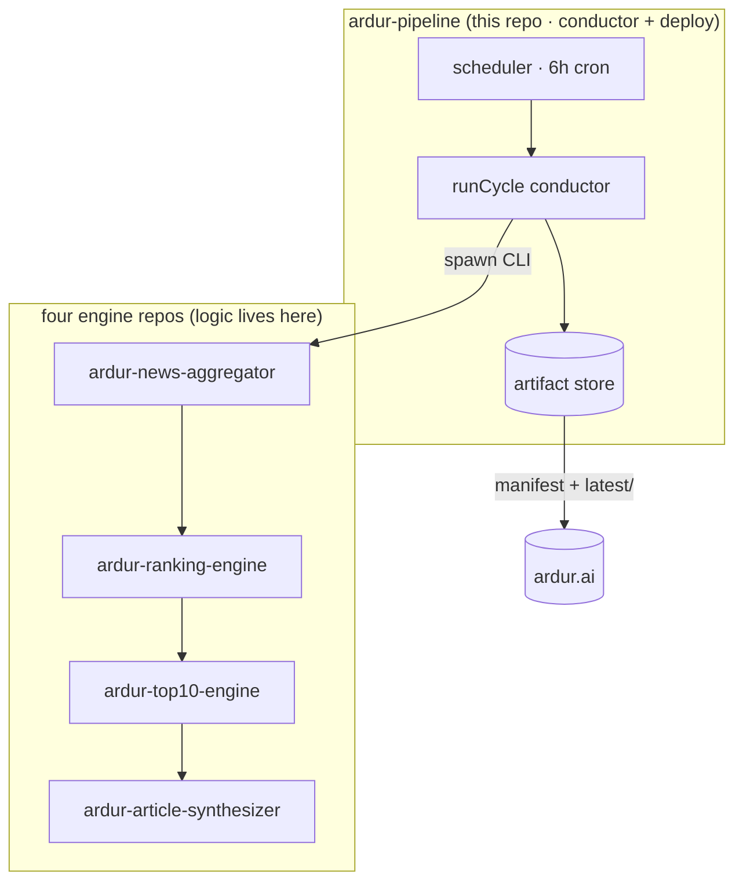
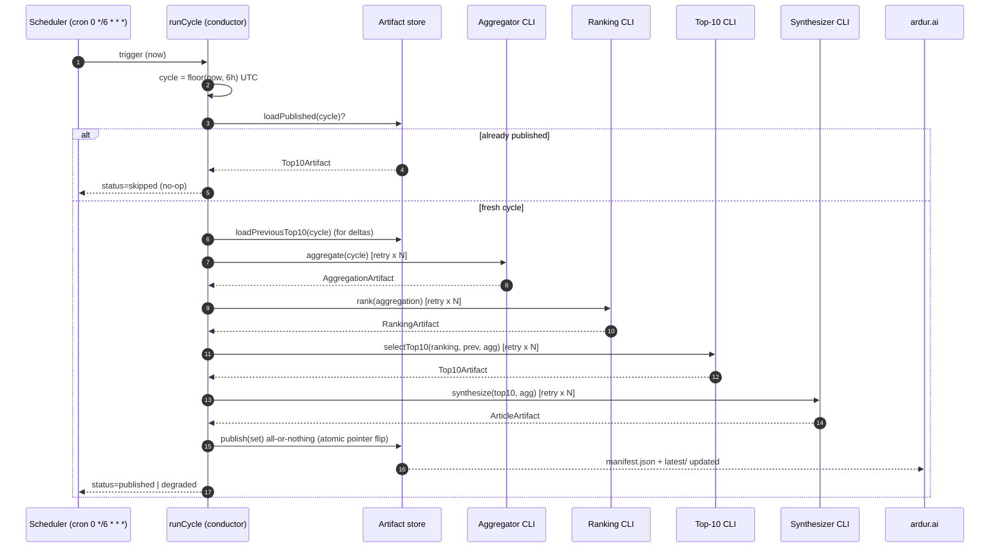
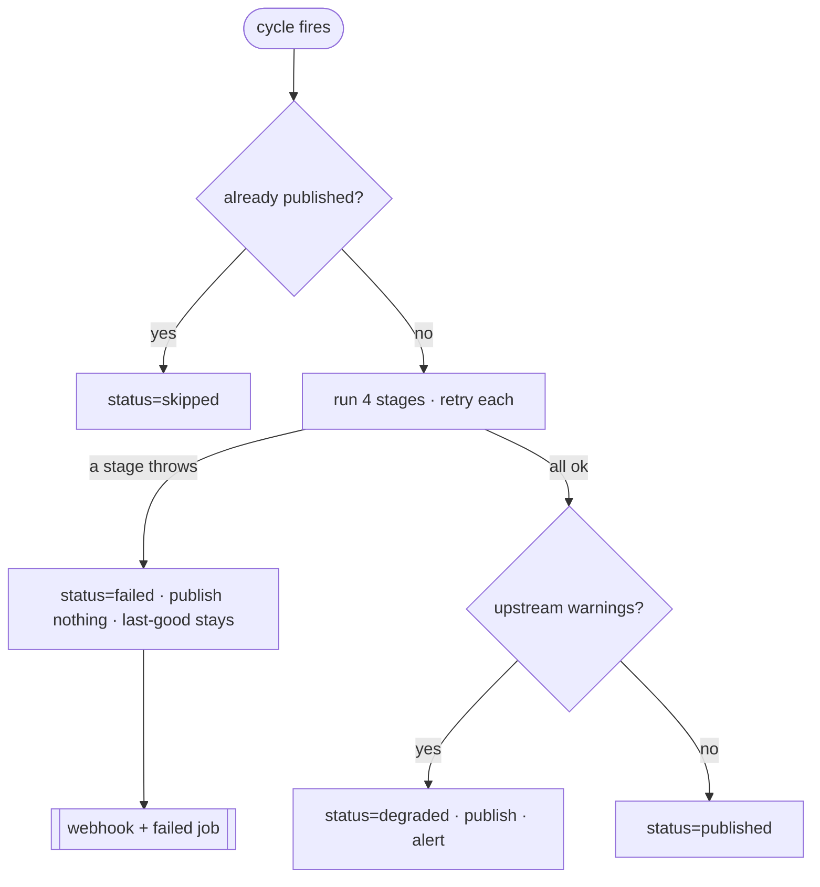

# ardur-pipeline — design spec

> The end-to-end orchestrator for the Ardur AI content pipeline. It runs the four
> engines on the **6-hour cycle** and emits the artifacts `ardur.ai` consumes.
> Schema: **`ardur-content-pipeline/v1`** (see [`src/contracts.ts`](../src/contracts.ts)).

## 1. Scope

`ardur-pipeline` is the **runtime host and conductor**. It owns:

- **When** the pipeline runs (the 6-hour schedule) and **where** (the deploy target).
- **Driving** the four engines in order and **threading** one cycle through them.
- **Idempotency, retries, last-good-wins**, observability, and alerting.
- The **data-handoff contract** to `ardur.ai` (what gets published, where, and how).

It explicitly does **not** own:

- **Engine logic** — aggregation, ranking, selection, and synthesis live in the four
  engine repos. This repo spawns their CLIs and never imports their internals.
- **The wire contract** — `src/contracts.ts` is vendored byte-identical from the
  engines (the single source of truth). This repo references it; it never forks it.
- **End-to-end tests** — true cross-engine E2E is owned by `ardur-engine-e2e`. The
  tests here cover only the orchestrator's own glue (cycle math, store, control flow).

### Relationship to `ardur-top10-engine`

`ardur-top10-engine` ships an **in-process** `runCycle` (a library conductor that takes
injected `StageRunners`). `ardur-pipeline` is the **out-of-process deployment conductor**:
it spawns all four engine CLIs as child processes, owns the artifact store and the
handoff to the site, and is what the scheduler actually invokes. The two share the same
contract and the same cycle math; they do not depend on each other's code.



## 2. The 6-hour cycle

The cycle is the unit of work **and** the unit of idempotency. Its id is
`floor(now, 6h)` in UTC, so windows start at **00:00, 06:00, 12:00, 18:00 UTC**.



If any stage throws after exhausting its retries, the conductor returns
`status=failed`, **publishes nothing**, and the previously published cycle keeps
serving. The CLI exits non-zero so the deploy layer also treats it as a no-publish.

## 3. Runtime / deploy

### 3.1 Recommendation

**GitHub Actions scheduled workflow** ([`.github/workflows/cycle.yml`](../.github/workflows/cycle.yml))
is the recommended runtime. The work is a short, infrequent batch (≤25 min, 4×/day)
with a generous 5h33m slack window — exactly what a scheduled CI job is good at, and
it keeps compute, secrets, logs, and the published artifacts in one place with zero
standing infrastructure.

| Option | Fit | Pros | Cons |
|--------|-----|------|------|
| **GitHub Actions schedule** (recommended) | ✅ batch, 4×/day | Free for public repos, native artifacts + branch publish, secrets, step summaries, `workflow_dispatch` backfill, no servers | Cron can be delayed minutes under load (fine: idempotent + 6h window); 6h+ inactivity can pause schedules (mitigated by `workflow_dispatch` + activity) |
| **Self-hosted cron / systemd timer** | ✅ if you already run a box | Full control, no minute drift, local Ollama on the same host | You own the host, secrets, log shipping, and uptime |
| **Serverless (Lambda/Cloud Run + EventBridge/Scheduler)** | ⚠️ heavier | Scales, managed schedule | 15-min Lambda cap is tight for the ≤25-min full cycle (Cloud Run Jobs OK); artifact store needs S3/GCS; most infra for the least benefit |

The orchestrator is deploy-agnostic: it reads config from env and writes a portable
artifact store. Moving runtimes only changes *where the store lives* and *who fires
the trigger* — the conductor is unchanged.

### 3.2 Idempotency & cycle IDs

- `cycleId = floor(now, 6h)` UTC, e.g. `2026-06-11T06:00Z`. Every instant in a window
  maps to the same id, so a delayed, retried, or backfilled trigger is the same cycle.
- `runCycle` calls `store.loadPublished(cycle)` first; if this cycle is already the live
  manifest it returns `status=skipped` without touching anything.
- At the deploy layer, the workflow's `concurrency` group prevents two cycles overlapping,
  and the publish step only runs on exit 0 — a re-fire of a published cycle is a cheap no-op.
- Backfill a missed window with `workflow_dispatch` + `--at 2026-06-11T06:00:00Z`.

### 3.3 Last-good-wins

Publishing is **all-or-nothing**. The store writes the immutable per-cycle archive
first, then swaps `latest/` and `manifest.json` into place via temp-dir/temp-file +
`rename` (atomic on the same filesystem). A reader that loads `manifest.json` always
sees a complete, internally consistent set. If the cycle fails before publish, the
pointer is never flipped and the previous cycle stays live — **no blank states**.

### 3.4 Retries

Each stage is wrapped in `withRetry` (default `STAGE_RETRIES=2`, exponential backoff
from `STAGE_BACKOFF_MS`). A transient failure (a flaky source fetch, a model timeout)
is retried; an exhausted stage throws and the cycle becomes last-good-wins. Per-stage
spawn timeouts (`STAGE_TIMEOUT_*_MS`) bound a hung engine. Cycle-level retry is the
scheduler re-firing — safe because the cycle is idempotent.

### 3.5 Observability & alerting

- **Structured logs** — one JSON object per line to stderr, every line tagged with
  `cycleId`, plus per-stage `ms` durations. Greppable in CI logs, shippable anywhere.
- **Run summary** — the CLI prints a `RunResult` JSON to stdout (status, warnings,
  timings, `nextRefreshAt`); the workflow renders it into the GitHub Step Summary.
- **Artifact upload** — the full `.artifacts/` tree is uploaded every run for forensics.
- **Alerting** — `ALERT_WEBHOOK_URL` (Slack/Discord/Opsgenie-compatible) fires on
  `failed` and `degraded`. A `failed` job also surfaces natively in GitHub's UI/email.

## 4. Data-handoff contract to ardur.ai

The pipeline writes an **artifact store** the site consumes. The site reads
`manifest.json` first (the last-good pointer), then `latest/` for payloads.

```
<store>/
  manifest.json              # last-good pointer (read this first)
  latest/
    aggregation.json         # AggregationArtifact
    ranking.json             # RankingArtifact
    top10.json               # Top10Artifact
    articles.json            # ArticleArtifact  <- the site's primary read
  cycles/<cycleId>/          # immutable archive (audit + rollback)
    aggregation.json ranking.json top10.json articles.json run.json
```

In CI this store is published to a dedicated **`published`** orphan branch of this repo
(see `cycle.yml`); the site consumes it by raw URL, git submodule, or a build-time fetch.
On a self-hosted runtime, point `ARTIFACT_STORE` at a directory the site reads, or sync
it to S3/GCS.

### `manifest.json` schema (the stable contract)

```jsonc
{
  "schemaVersion": "ardur-content-pipeline/v1",
  "cycle": { "id": "2026-06-11T06:00Z", "windowStart": "...", "windowEnd": "..." },
  "status": "published" | "degraded",
  "publishedAt": "ISO-8601",
  "nextRefreshAt": "ISO-8601",                 // = cycle.windowEnd
  "runIds": { "aggregation": "...", "ranking": "...", "top10": "...", "articles": "..." },
  "artifacts": { "aggregation": "cycles/.../aggregation.json", "...": "..." },
  "warnings": [ "..." ],
  "summary": {
    "topicsCovered": ["ai", "security", "..."],
    "globalTop10": [ { "rank": 1, "topic": "ai", "headline": "..." } ],
    "articleCount": 10
  }
}
```

Consumption rules for the site:

1. Read `manifest.json`. If `schemaVersion` is one you accept, proceed; else keep the
   last good copy.
2. `summary` is enough to render a board with no payload parsing; fetch `latest/articles.json`
   for full in-app articles.
3. `nextRefreshAt` tells the UI when the next cycle is due (countdown / cache TTL).
4. Treat `latest/` as atomic — never mix it with a different cycle's archive.

The contract is **additive-only**: new optional fields never break an older consumer;
a breaking change bumps `SCHEMA_VERSION` and is gated by the consumer.

## 5. Failure handling & deterministic / budget=0 fallback

Two independent layers of safety:

1. **In-engine fallback (budget=0).** Every AI-touching engine (ranking, synthesis)
   defaults to a deterministic, zero-cost, zero-network path. `ARDUR_AI_MAX_GENERATIONS=0`
   forces it; any provider error or per-call timeout falls back to deterministic output.
   The orchestrator forwards `ARDUR_AI_PROVIDER` / `MAX_GENERATIONS` / `TIMEOUT_MS` to
   every child, so the **whole chain can run with no API key and no network model call**
   and still produce a complete, publishable cycle. This is the CI default.
2. **Cross-stage fallback (last-good-wins).** A stage that fails outright (after retries)
   aborts the cycle without publishing; the site keeps serving the previous cycle.

`degraded` sits between green and failed: the cycle published, but an engine reported
non-fatal `warnings` (e.g. a source diversity floor missed, budget exhausted mid-cycle).
The site still gets fresh content; the warnings are surfaced in the manifest and alerted.



## 6. SLOs

Inherited from the shared architecture; the orchestrator's job is to keep cycles inside
the 6-hour window and never serve a blank board.

| SLO | Target |
|-----|--------|
| Full-cycle p95 latency | ≤ 25 min (≥ 5h33m slack inside the 6h window) |
| Per-stage p95 | aggregate ≤ 8 min · rank ≤ 60 s · top10 ≤ 30 s · synth ≤ 12 min |
| **Freshness** | published `articles.json` is never older than **one cycle + 25 min** |
| **Availability** | on any cycle failure, the previous cycle keeps serving (no blank states) |
| Idempotency | a re-fired/backfilled cycle never double-publishes or corrupts `latest/` |
| Alerting latency | a `failed`/`degraded` cycle pages within one run (webhook + native CI alert) |

Stage timeouts are sized so even a worst-case full cycle (every stage at p95) stays
well under the window; the slack absorbs scheduler drift and one full retry pass.

## 7. Engine handoff (CLI contracts)

The orchestrator invokes each engine's `src/cli.ts` and parses stdout as the next
artifact. This is wiring only — engine internals may change freely behind these CLIs.

| Stage | Invocation | In | Out |
|-------|------------|----|----|
| aggregate | `cli.ts` | — | `AggregationArtifact` (stdout) |
| rank | `cli.ts <aggregation.json>` | aggregation | `RankingArtifact` (stdout) |
| top10 | `cli.ts <ranking.json> <prev|-> <aggregation.json>` | ranking + prev + agg | `Top10Artifact` (stdout) |
| synthesize | `cli.ts --top10 t.json --aggregation a.json` | top10 + agg | `ArticleArtifact` (stdout) |

Upstream artifacts are written to a per-cycle scratch dir and passed as file args.
The synthesizer takes both the Top-10 and the aggregation (it resolves cluster members
to copyright-safe references). All four honour the same provider/budget env.

## 8. Configuration

All config resolves from env once ([`src/config.ts`](../src/config.ts)); an empty env
yields a deterministic, budget=0 cycle. See [`.env.example`](../.env.example) for the
full list: engine locations (`ENGINES_DIR`, `ENGINE_*`), `ARTIFACT_STORE`, AI knobs
(`ARDUR_AI_PROVIDER` / `MAX_GENERATIONS` / `TIMEOUT_MS`), per-stage timeouts and retries,
and observability (`ALERT_WEBHOOK_URL`, `LOG_FORMAT`).

## 9. Open items

- `published`-branch publish vs. direct sync to the site's data dir vs. object store —
  the workflow ships the branch approach; pick per deploy target.
- A future `@ardurai/pipeline-contracts` npm package could replace the vendored
  `contracts.ts` across all repos (tracked in the shared `ARCHITECTURE.md`).
- Cross-engine E2E coverage is owned by `ardur-engine-e2e`; this repo stops at glue tests.
